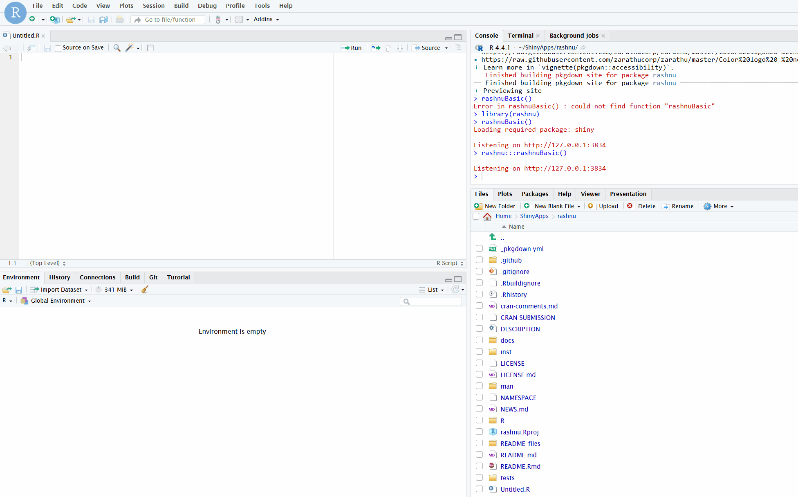

# Rashnu

**Rashnu** is the Zoroastrian deity of truth and justice—the one who
weighs souls on a golden scale.  
This R package, developed by **Zarathu**, draws inspiration from
Rashnu’s role as the divine judge to offer precision and fairness in
sample size determination.

> *“Where truth is weighed, science begins.”*

------------------------------------------------------------------------

In clinical trials and research design, every decision matters.  
**Rashnu** helps researchers define the *right* number of participants
for: - Non-inferiority studies - Superiority comparisons (Lakatos
method) - One-arm survival designs with transformation-based inference

This package brings clarity, rigor, and justice to your design process.

## Installation

You can install the development version of rashnu from
[GitHub](https://github.com/zarathucorp/rashnu) with:

``` r
# install.packages("pak")
pak::pak("zarathucorp/rashnu")
```

## Example

### Rstudio Addins

Use `rashnuBasic()` or Click **Interactive Sample Size Calculator**
Addin

``` r
rashnuBasic()
```



### Two sample survival non-inferiority

``` r
twoSurvSampleSizeNI(
   syear = 12,
   yrsurv1 = 0.5,
   yrsurv2 = 0.5,
   alloc = 1,
   accrualTime = 24,
   followTime = 24,
   alpha = 0.025,
   power = 0.8,
   margin = 1.3
)
```

``` r
$Sample_size_of_standard_group
[1] 264

$Sample_size_of_test_group
[1] 264

$Total_sample_size
[1] 528

$Expected_event_numbers_of_standard_group
[1] 227.9

$Expected_event_numbers_of_test_group
[1] 227.9

$Total_expected_event_numbers
[1] 455.9
```

### Two sample survival superiority

``` r
lakatosSampleSize(
   syear = 12,
   yrsurv1 = 0.3,
   yrsurv2 = 0.5,
   alloc = 1,
   accrualTime = 24,
   followTime = 24,
   alpha = 0.05,
   power = 0.8,
   method = "logrank",
   side = "two.sided"
)
```

``` r
$Sample_size_of_standard_group
[1] 58

$Sample_size_of_test_group
[1] 58

$Total_sample_size
[1] 116

$Expected_event_numbers_of_standard_group
[1] 55.6

$Expected_event_numbers_of_test_group
[1] 49.7

$Total_expected_event_numbers
[1] 105.3

$Actual_power
[1] 0.803
```

### One sample non-parametric survival

``` r
oneSurvSampleSize(
   survTime = 12,
   p1 = 0.3,
   p2 = 0.4,
   accrualTime = 24,
   followTime = 24,
   alpha = 0.05,
   power = 0.8,
   side = "two.sided",
   method = "log-log"
)
```

``` r
SampleSize      Power 
   189.000      0.802 
```
